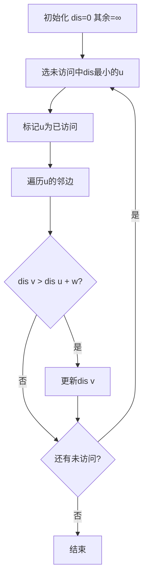

## 算法简介

Dijkstra 算法用于求解**非负权图**上单源最短路径问题，时间复杂度 $O((V+E)\log V)$（堆优化）。

:::tip
适合**稠密到中等密度**的图。边数 $E \ll V^2$ 的稀疏图用堆优化效果显著。
:::

## 算法步骤



## 堆优化实现

```cpp
void dijkstra(int s, int n) {
    fill(dis, dis + n + 1, INF);
    priority_queue<pair<long long, int>, vector<pair<long long, int>>, greater<>> pq;
    dis[s] = 0; pq.push({0, s});
    while (!pq.empty()) {
        auto [d, u] = pq.top(); pq.pop();
        if (vis[u]) continue;
        vis[u] = true;
        for (auto [v, w] : adj[u])
            if (dis[v] > dis[u] + w) {
                dis[v] = dis[u] + w;
                pq.push({dis[v], v});
            }
    }
}
```

## 注意事项

:::warning
**不能处理负权边**！有负权请用 Bellman-Ford 或 SPFA。
:::
